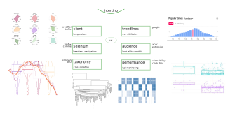

# intertino 


geomadi is a library for spatial operations



_overview of intertino modules_

-----------
intertino is a collection of utils for web market.
It includes source code for:
* data collection - platform apis, crowlers
* storage - sql, mongo, hdfs, aws
* cleaning - stemming, distribution tail cutting, sampling
* processing - 
* transformation - rational to document base, preparation for networks, dendrograms, d3
* prediction - time series forecast
* modeling - model training
* visualization - heatmaps, circle pack, sunburst, d3

Reference
---------------
Project page [intertino](http://dauvi.org/intertino/)

Sources
-------------
```
R, python, bash, javascript, d3
```
