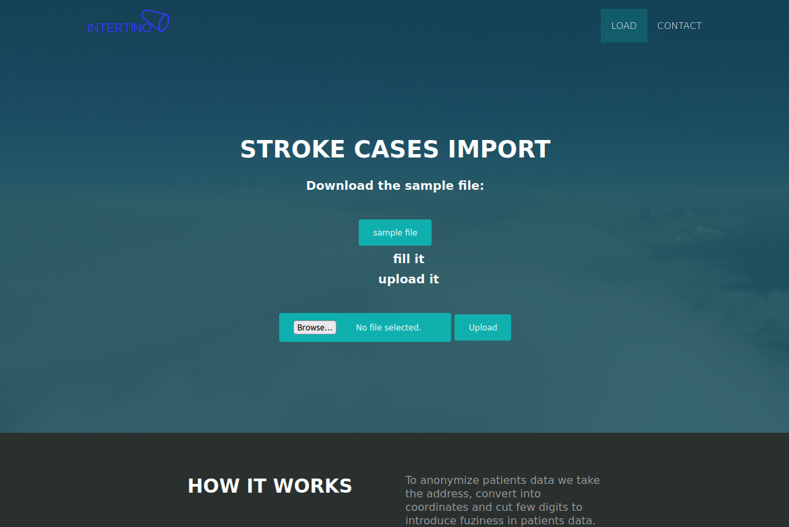

# geocode
nodejs app for geocoding from a template and delete sensitive data

_index showing the upload of the filled in csv. The background operations will geocode the addresses and delete the sensitive data before importing to the database_
