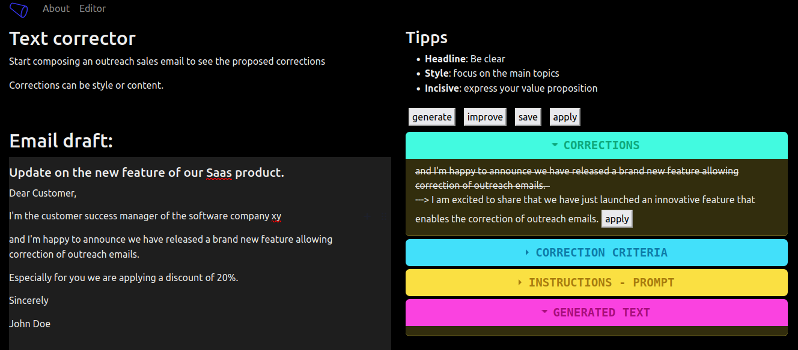
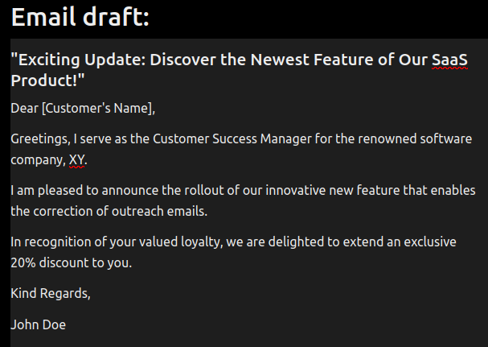
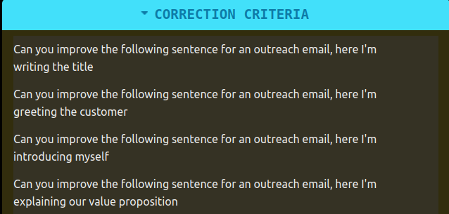
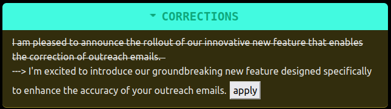
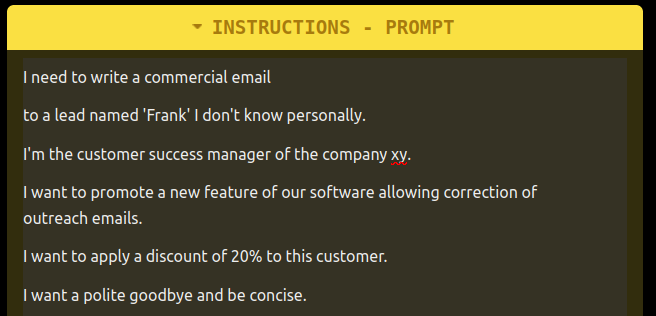
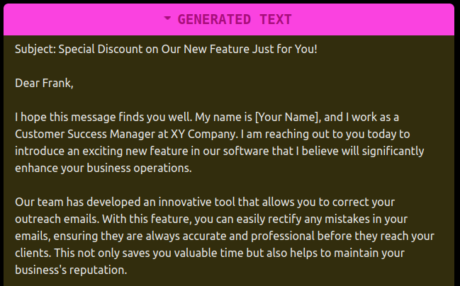
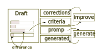
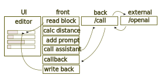

# text corrector

This app is an automated assistant to help writing outreach sales emails. 


_text corrector overview_

## usage

The user starts editing the draft in the left box, the draft is composed in different sections:

* subject
* greeting
* presentation
* value proposition
* personalization
* goodbye
* signature


_the editor block composed in sections_

Every time a change is made an algo evaluates the distance from the previous version is computed. The current algo is a mixture of Levenshtein and time difference. 
If the change is consistent enough the current text is appended to a prompt for the language model which can be edited in this section:


_the criteria block with editable prompts_

The resquest is sent to the backend that appends the authentification and sends the request to the language model. Within few seconds the response is formated and displayed in the correction block:


_the correction block with suggestions_

The correction block has an apply button that validates the correction and apply the change.

Alternatively there is an instruction section with editable prompts


_the instruction block with editable prompts_

That would send a request to the language model to generate the email following the instructions


_the generated block with suggestions_

## technical implementation

The app is mainly written in `nodejs` using `express` and `ejs`. The main functions are written in `javascript` and executes on the frontend.


_front- and back- end implementation_

The implementation is as following


_structure of the calls_

## deployment

Create an `.env` file with:
```
export OPENAI_KEY=...
```
run

```
npm install
npm start
```

or

```
cd build/
docker-compose up -d
```

The app is then available at:

```
localhost:3000/correct
```
