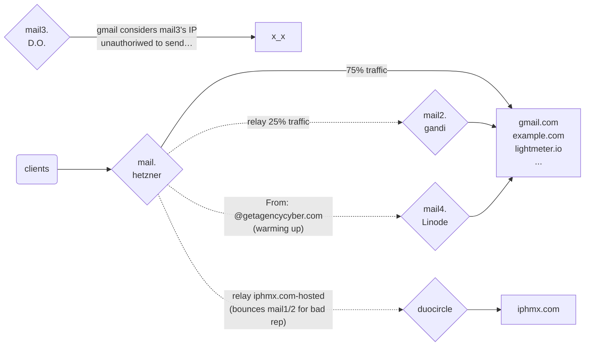

# Mail server setup

TODO: explain what each image is about!

## Building docker images

```bash
./build-images.sh
```

## Generating DKIM keys

```bash
./gen_dkim_key.sh example.com
```

Then commit the changes and new files added to `origconf/etc/opendkim/`

Finally, re-generate the docker images.

TODO: push it to a registry

## Check all DNS records are set

```bash
./dns-checklist.sh example.com
```

It'll output lines in the format `[ $A ] -> ($B) -> $C`, where `$A` can have the following values:

  - Y: the record is properly set
  - N: the record is not set at all. You should use the value of `$C` in your DNS records manager.
  - E; the record is set to the wrong value. You or the customer must fix it in the DNS records manager.

## Add mailbox

```bash
./add_mailbox.sh user@example.com
```

You'll be asked only one for the password. Type it and press enter.

## Add support for HTTP redirection on the domain, if needed

So that then users go to http://domain.com they are redirected to http://mycompany.com

Add a new redirection entry to the map at `http-redirection.sh`.

```bash
./mailserver/gen_redirect_snippets.sh
```

Then commit the changes at `mailserver/origconf/etc/apache2/sites-available/`.

In the mail server, you can test if the domains were applied with the command:

```bash
docker compose -f docker-compose-router.yml exec mailserver apachectl -t -D DUMP_VHOSTS
```

It should list all the virtualhost entries that apache is handling.

## Semi automated deployment

You can have a one-click deployment for each email server by going to the [Pipelines page](https://gitlab.com/lightmeter/infrastructure/-/pipelines)
and clicking on the second "Stages" button or the most recent build, and clicking on the server you want to deploy.

### Server configuration

You can add/remove/manage server deployments by changing the `deploy-mailX` entries in the top-level `.gitlab-ci.yml` file. Commit and push.
